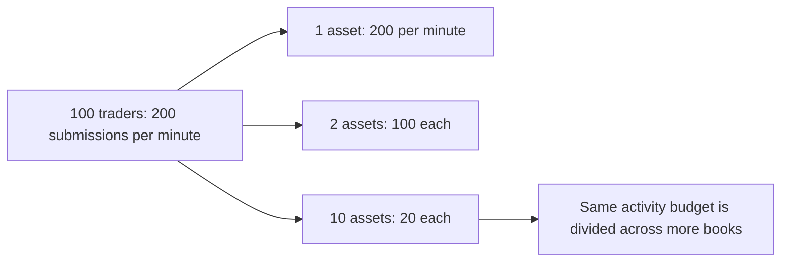
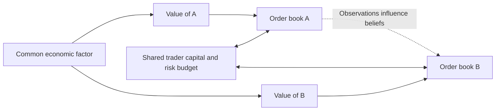
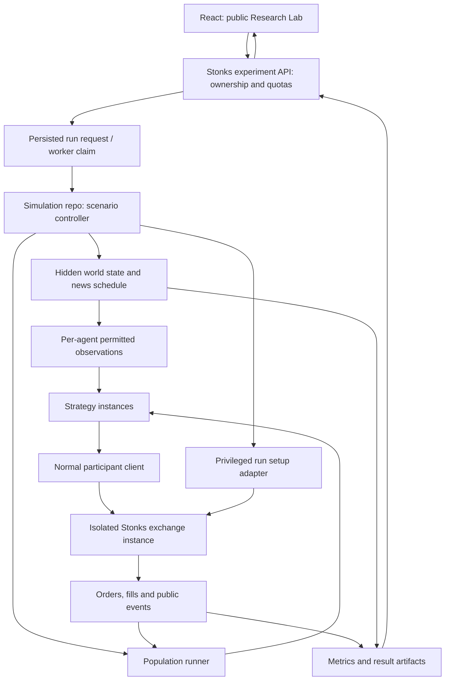

# Stonks: from exchange to experimental market

A design proposal and financial-mathematics primer for a physics graduate. September 2026.

**Status:** this document proposes future simulation and product features. The current exchange implements cash-backed spot trading, atomic accounting and recoverable participant data. It does **not** yet implement experiment orchestration, isolated public sandboxes, fundamental-value processes, fees, short selling, derivatives or deterministic simulation time.

The central question is: **what mechanism makes a trading opportunity exist, and does it survive when the environment changes?** Stonks can become a laboratory for answering that question.

## Reading map

1. [One, two and ten assets](#1-one-two-and-ten-assets)
2. [Populations and personalities](#2-populations-and-personalities)
3. [Repositories, services and control](#3-repositories-services-and-control)
4. [A public product people can use](#4-a-public-product-people-can-use)
5. [Financial mathematics through experiments](#5-financial-mathematics-through-experiments)
6. [An experimental programme](#6-an-experimental-programme)
7. [Further study](#7-further-study)

## 1. One, two and ten assets

### Think in flows, not headcounts

Let there be $N$ traders and $A$ assets. Trader $i$ submits order messages at average rate $\lambda_i$ and allocates fraction $p_{ij}$ to asset $j$. Then

$$
\Lambda_j=\sum_{i=1}^{N}\lambda_i p_{ij},\qquad \sum_{j=1}^{A}p_{ij}=1.
$$

Here a message is a submission, not necessarily a fill. Cancellation and replacement traffic should be measured separately. Under homogeneous rates and uniform allocation, $\Lambda_j=N\lambda/A$.

Suppose each trader submits an average of two orders per minute **in total**:

| Traders | 1 asset | 2 assets | 10 assets |
|---:|---:|---:|---:|
| 20 | 40 orders/min/asset | 20 | 4 |
| 100 | 200 | 100 | 20 |
| 1,000 | 2,000 | 1,000 | 200 |

These are arithmetic illustrations, not realistic-market thresholds. The calculation does not tell us whether both sides receive orders, orders cross, quotes survive or anybody has inventory to sell.



Under an independent Poisson arrival approximation, the probability of no submissions during interval $\Delta t$ is $e^{-\Lambda_j\Delta t}$. With 20 traders and ten assets, the mean is four submissions per minute per asset: about 51% of ten-second windows contain none. With one asset and 40/minute, this falls to about 0.13%. Real order arrivals cluster; this is an intuition-building null model.

Capital matters independently. Ten bots each with a million simulation units are economically different from ten thousand bots each with ten units. One fast bot is not equivalent to many independent beliefs. Define order-flow concentration $H_j=\sum_i s_{ij}^2$, where $s_{ij}$ is each trader's share of submissions in asset $j$. Then $1/H_j$ is an effective contributor count: 100 accounts can still behave like a two-participant market. Compute analogous measures for volume and capital.

### One asset: learn the local mechanics

There is one risky asset **and cash**, so there is already an allocation decision. This setup supports spread formation, inventory risk, price discovery, execution, informed trading and liquidity shocks.

Start here because a strange price move is easier to explain. Was it new information, a large impatient order, a withdrawn quote or exhausted purchasing power?

You cannot investigate cross-asset hedging or sector contagion. You can investigate almost all the foundations of market microstructure.

### Two assets: the first qualitative change

Two unrelated assets with independent traders are largely two copies of the one-asset experiment. The interesting change comes from **coupling**:

- Correlated economic shocks affect both values.
- One trader allocates a limited cash balance between both books.
- A market maker shares an inventory-risk budget across both assets.
- Traders use news or prices in one asset to update beliefs about the other.

A loss in A can therefore force selling in B even when B receives no bad news. This is an experimentally useful contagion mechanism.



Correlation alone does not create an arbitrage. If A rises and B does not, B need not catch up. A credible relative-value experiment must specify an economic relationship or a stationary spread, and allow that relationship to fail.

### Ten assets: a small market ecology

Ten assets enable sectors, diversification, portfolio rebalancing, uneven liquidity, common-factor shocks and competition for capital. There are 45 distinct pairwise correlations, versus one with two assets; estimating them from short runs is already noisy.

If trader activity stays fixed, books may become sparse. If every trader instead trades every asset at the original rate, aggregate load grows roughly with asset count. Neither is automatically the correct comparison.

Use three separate experiments:

| Design | Hold fixed | What it answers |
|---|---|---|
| Liquidity dilution | Total capital and total submission rate | What does adding listings do to a fixed market? |
| Scale replication | Capital, supply value and activity per asset | Can a larger market retain similar local liquidity? |
| Coupling | Per-asset marginals, but vary shared exposures | What do correlations and shared constraints change? |

When varying headcount, decide whether total capital/activity changes too. To isolate population diversity, distribute the **same** total resources across more independent agents. To study market growth, increase resources deliberately. Record both choices.

**Suggested progression:** one asset for mechanics; two for coupling; ten only after we can explain the two-asset results. There is no minimum number that makes a simulation “real”.

## 2. Populations and personalities

### Start with economic motives

| Family | Objective | Internal state | Failure mode worth studying |
|---|---|---|---|
| Market maker | Earn spread subject to inventory risk | Inventory, recent flow, volatility estimate | Adverse selection; inventory saturation |
| Value trader | Trade against an imperfect estimate of value | Belief mean/uncertainty, position | Wrong model; early entry; insufficient capital |
| Liquidity trader | Meet an external portfolio/cash need | Target holdings, urgency | Paying high execution costs |
| Execution agent | Complete a parent order efficiently | Remaining quantity, deadline | Impact versus non-completion |
| Momentum trader | Follow persistent price movement | Trend estimate and risk budget | Reversals and crowded exits |

Price discovery is a **market process**; fundamental value is a **model quantity**; risk is a **property of outcomes**. They are not themselves strategies. A strategy converts observations and objectives into decisions.

A population might initially contain 4 makers, 20 value traders, 50 liquidity traders, 15 momentum traders, 10 execution agents and your one research agent. Treat this as a starting hypothesis, not a calibrated distribution. An execution agent needs an external parent order; a liquidity trader's target change must have a defined source. Avoid counting the same demand twice.

### Personality as a parameter vector

For agent $i$, use something like

$$
\theta_i=(\text{capital},\text{inventory limit},\text{horizon},\text{urgency},
\text{signal noise},\text{reaction delay},\text{risk aversion},\text{activity rate}).
$$

Draw these from documented distributions, with meaningful dependencies: a large institution might have a longer horizon and split orders; a fast maker might have tight inventory limits. Persistent characteristics should not be redrawn at every decision.

An agent's state then evolves: capital changes with P&L, beliefs update with observations, urgency rises toward a deadline. Random seeds govern random inputs, not arbitrary price movements imposed on the exchange.

Do not give all bots perfect fundamental values or identical reactions to headlines. Also do not make all bots predict returns: genuine liquidity needs create reasons for mutually beneficial trades.

Finite cash and supply can make activity stall. Specify initial allocations, external cash-flow policy, dividends or finite episode endings. Any endowment/reset is a recorded experimental intervention, not a hidden rescue of losing bots.

## 3. Repositories, services and control

A repository is a code boundary, not a requirement for another machine or one process per agent. Initially one bot runner can host many independently stateful agents.

### Recommended ownership

| Location | Responsibility |
|---|---|
| Stonks repository | Exchange, participant API, React trading UI, public research UI, authenticated experiment-facing API |
| Simulation repository | Strategy library, population runner, scenario definitions, orchestration worker, offline analysis |
| Versioned contract | Run manifest, permitted observations/actions, event schemas, result schema |

The **strategy library** decides what each bot does. The **population runner** schedules bots, gives each only its allowed observations and submits ordinary authenticated trading commands. The **scenario controller** owns episode lifecycle, initial conditions, hidden world state and event timing. These can be modules of one simulation application initially.



Hidden world state reaches the analyst and explicitly authorised observation adapters. It must not be embedded in ordinary public news or market-data payloads. In competitive runs, publish hidden truth only after the run, or in a separate non-participating observer mode.

### How a dashboard click becomes an experiment

1. The user selects a preset, changes allowed parameters and clicks **Run**.
2. A proposed `POST /research/runs` validates the manifest, ownership, resource limits and scenario version. This endpoint does not exist yet.
3. A worker claims the durable job. The scenario controller provisions a fresh exchange environment and records code versions and seeds.
4. Privileged setup creates the initial users, cash and holdings through explicit audited operations. Existing asset approval and equal signup grants do not yet provide this complete setup contract.
5. The controller starts the runner and scheduled economic/information events. Agents trade through the participant API.
6. A metrics consumer updates the run page. Completion produces a frozen manifest, event record and downloadable results.

Prefer a persisted job with a worker claim over a browser holding a connection to the simulation process. Browser closure must not lose run ownership or leave an untracked process.

Proposed lifecycle: `QUEUED → STARTING → RUNNING → COMPLETED`, with `FAILED` and `CANCELLED` outcomes. Stop/cancel commands need idempotency too. Pause is more involved: define whether logical time, order admission and all timers pause together.

### News control and the existing admin page

Today news injection publishes a durable public headline and sentiment. It does not update a hidden economy. In an experiment, the UI should send a **scenario intervention** to the controller; the controller records any value shock privately and schedules the public news separately.

For example: value shock at simulated minute 20; noisy early signals to a permitted group at minute 21; public announcement at minute 25. Store both intended event times and actual exchange acceptance order. Public sentiment is an observation, not a secret copy of the correct future return.

Manual interventions make an episode exploratory. Preserve them in an intervention log so later replay can include them; do not mix these results silently with untouched benchmark runs.

### Isolation and timing are the main infrastructure decisions

For the first hosted version, run a small queue of **separate exchange stacks/databases**, one per active sandbox. It costs more resources but fits today's single-world exchange. A database schema alone is insufficient: Redis channels, credentials, connection settings and all stateful services also need isolation. Separate networks/Redis instances are a straightforward initial choice.

Later, multi-tenancy could put `run_id` through every table, command, query, event, authorisation rule and sequencing boundary. That is a substantial exchange change, not just a dashboard filter.

Support two deliberately distinct modes:

- **Live market:** humans and independently running bots use wall-clock time. Record actual ordering; identical seeds do not guarantee identical runs.
- **Controlled experiment:** a logical event scheduler controls agent wakeups, observations and command ordering. Reproducibility requires deterministic random streams, tie-breaking, clocks and state transitions—not only an initial seed.

A first deterministic runner can serialise commands for repeatable decision order, but full accelerated simulation also requires the exchange's timestamps, candles, expiries and metrics to understand logical time. This is future work. ABIDES is a useful architectural reference for discrete-event agents and latency; our proposed integration is specific to Stonks. [ABIDES](https://arxiv.org/abs/1904.12066)

## 4. A public product people can use

Keep a single Stonks website with three visible experiences and a private operations area:

| Surface | User experience | Authority |
|---|---|---|
| **Trade** | Join a shared simulated market with personal cash/inventory | Own orders and account |
| **Observe** | Explore books, trades, liquidity, news and aggregate market health | Public read-only projections |
| **Experiment** | Clone a preset, tune parameters, run, compare and share results | Own isolated runs |
| **Operations** | Approve assets, manage deployments, moderate jobs | Private operator permissions |

The existing admin page mixes observation and control. Reuse its visual components, but **do not simply remove its role guard**. Its all-trades and leaderboard endpoints may expose participant information. Build explicit public projections containing anonymous trades and aggregate metrics; make identity-bearing leaderboards opt-in.

### Useful interactions

- **Thin versus deep market:** change maker capital and activity; compare execution cost for the same order size.
- **Information race:** change the fraction of informed agents and their observation delay; inspect price discovery and maker losses.
- **Liquidity drought:** withdraw some makers mid-run; inspect spread, depth and recovery.
- **One versus ten listings:** choose fixed total resources or fixed resources per asset, then compare.
- **Contagion:** shock one asset; compare independent versus shared risk budgets.
- **Execution challenge:** complete a parent order using immediate execution, TWAP or your own strategy.

Start with 5–8 understandable controls: asset count, population preset, total capital, activity, maker allocation, information noise/delay and shock size. Expose advanced strategy parameters in a second panel. Show units and the dependent quantities: changing asset count should immediately display expected activity and capital per asset.

Use **preview → estimate runtime → run → compare**. Sliders configure a new run by default. Editing a running experiment becomes a named intervention. For a shared market, visitors can propose events or fork a sandbox; they cannot arbitrarily change everyone else's world.

### Dashboard sketch

```text
STONKS   Trade   Observe   Experiment   Learn

Experiment: Does delayed information widen spreads?   [Clone] [Share]
Run status: Completed    Seed: 42    Model: v0.1    Mode: controlled

[Preset / parameters]  [Price and hidden value*]   [Book and spread]
[Run / compare]        [News / intervention log]   [Depth / cost to trade]

[P&L by cohort*]       [Inventory / drawdown]       [Distribution across seeds]
[Manifest]            [Export data]               [Assumptions and limitations]

* Hidden value and private cohort diagnostics follow observer permissions.
```

Offer curated completed runs before opening unrestricted compute. Later add login, per-user job limits, bounded duration/agent counts and queue status. Start with built-in strategies; arbitrary uploaded user code requires a separate execution sandbox and should be a later project.

Shared links should capture immutable completed results and manifests, not a dashboard whose settings keep changing. Clearly distinguish **live simulated trading**, **experimental output**, and **illustrative examples**.

## 5. Financial mathematics through experiments

### 5.1 Prices, returns and self-financing wealth

For price $S_t$, simple return is $R_t=S_{t+\Delta}/S_t-1$ and log return is $r_t=\log(S_{t+\Delta}/S_t)$. Log returns add across time; simple returns aggregate across portfolio weights over one period.

With cash $C_t$ and holdings $q_{jt}$, marked wealth is

$$
W_t=C_t+\sum_j q_{jt}S_{jt}.
$$

Reserved cash and shares still belong in wealth. A fill of signed quantity $\Delta q$ at price $p$ changes cash by $-p\Delta q-\text{fee}$. Buying does not create wealth: it changes composition. Marking at a midpoint may hide the cost of liquidation through the book.

**Experiment:** buy and immediately sell a small quantity in an unchanged book. Explain the loss using spread and fees. Then increase size and observe additional slippage.

### 5.2 Microstructure and price discovery

Best bid $b_t$ is the highest displayed buying price; best ask $a_t$ is the lowest selling price. Midpoint and quoted spread are

$$
m_t=(a_t+b_t)/2,\qquad s_t=a_t-b_t.
$$

Neither exists as a two-sided metric if one side is empty. Record missingness; do not turn an empty book into a zero spread. Depth measures available quantity at defined price levels or distances from midpoint. These are also practical exchange liquidity measures. [CME methodology](https://www.cmegroup.com/education/articles-and-reports/understanding-the-cme-liquidity-tool-methodology)

```text
Sellers:       100.03   15 shares
               100.02    8 shares  ← best ask
               ─────────────────
Midpoint:      100.01              Spread: 0.02
               ─────────────────
Buyers:        100.00   12 shares  ← best bid
                99.99   20 shares

A buy for 10 shares consumes 8 at 100.02 and 2 at 100.03.
Average price = 100.022; cost above initial midpoint = 0.012/share.
```

For fill price $p$ and aggressor sign $\epsilon=+1$ for buyer-initiated and $-1$ for seller-initiated trades, effective spread is $2\epsilon(p-m_{\text{before}})$. Measure later signed midpoint movement $\epsilon(m_{t+h}-m_{\text{before}})$ to investigate impact and adverse selection. A horizon must always accompany such a statistic.

Price discovery is the incorporation of dispersed information into traded prices. In a simulation with known hidden value $V_t$, measure $\operatorname{RMSE}(m,V)$ and response time after shocks. Lower error is conditional on the model's definition of value; it is not proof that the same price would be correct in reality.

### 5.3 Fundamental value and imperfect information

For a claim paying dividends $D_u$ and a terminal payment $X_T$, valuation connects today's price to uncertain future payments and discounting. In a simple risk-neutral pricing model with constant interest rate $r$,

$$
V_t=\mathbb E^{\mathbb Q}\!\left[\sum_{u>t} e^{-r(u-t)}D_u+e^{-r(T-t)}X_T\mid\mathcal F_t\right].
$$

Under real-world probabilities, risk adjustment is needed; simply discounting every expected risky cash flow at the risk-free rate is generally wrong. For fictional assets, define an explicit redemption/payoff rule or call $V_t$ a latent reference value rather than claiming an arbitrage-enforced fair price.

A useful positive reference-value model is $V_{jt}=e^{x_{jt}}$, with

$$
dx_{jt}=\kappa_j(\mu_j-x_{jt})dt+\beta_j\sigma_F dW_{Ft}+\sigma_j dW_{jt}.
$$

This is a modelling choice: a mean-reverting log value driven by common and idiosyncratic shocks. It does not dictate transaction prices. Specify the time unit of every parameter.

Agent $i$ might observe $y_{it}=x_{t-\tau_i}+\eta_{it}$, with $\eta_{it}\sim N(0,\nu_i^2)$. Delay $\tau_i$ and noise $\nu_i$ produce information differences. In the scalar Gaussian case, a prior mean $\hat x^-$ with variance $P^-$ updates as

$$
K=\frac{P^-}{P^-+\nu_i^2},\quad
\hat x^+=\hat x^-+K(y-\hat x^-),\quad P^+=(1-K)P^-.
$$

This is a Kalman measurement update; delayed observations require additional state handling. A value trader acts only when its estimated advantage exceeds spread, fees and risk. Updating beliefs and constructing an order are separate steps.

**Experiment:** vary observation noise and informed-agent capital separately. Accurate information with no purchasing power may have little effect on prices.

### 5.4 Risk, correlation and portfolios

For a vector of one-period returns $R$ with mean $\mu$ and covariance $\Sigma$, a fixed-weight portfolio has

$$
\mathbb E[R_p]=w^\top\mu,\qquad \operatorname{Var}(R_p)=w^\top\Sigma w.
$$

Two equally weighted assets with equal volatility $\sigma$ and correlation $\rho$ have volatility $\sigma\sqrt{(1+\rho)/2}$. At $\rho=0$ this is $0.707\sigma$; at $\rho=1$ there is no diversification benefit. For $A$ equally weighted equicorrelated assets,

$$
\sigma_p^2=\sigma^2\left(\rho+\frac{1-\rho}{A}\right).
$$

At positive common correlation, adding assets does not remove common-factor risk. This explains why ten economically linked assets are different from ten independent copies.

Mean–variance allocation solves a version of

$$
\max_w\;w^\top\mu-\frac{\gamma}{2}w^\top\Sigma w
\quad\text{subject to capital and position constraints}.
$$

Small errors in estimated expected returns can produce large weight changes. Constraints, shrinkage and turnover penalties matter. In Stonks today, negative holdings are unavailable: model a long-only portfolio plus cash unless shorting is explicitly added.

Useful risk measurements:

- **Volatility:** dispersion of returns over a specified interval; it treats gains and losses symmetrically.
- **Drawdown:** $1-W_t/\max_{u\le t}W_u$; maximum drawdown is path-dependent.
- **VaR:** the $\alpha$ quantile of a defined loss variable $L$ over a defined horizon.
- **Expected shortfall:** $\mathrm{ES}_\alpha=(1-\alpha)^{-1}\int_\alpha^1\mathrm{VaR}_u\,du$; this handles discrete losses too.
- **Liquidity risk:** loss/cost from exiting when depth disappears; volatility alone misses it.

For a normal loss distribution, $\mathrm{VaR}_\alpha=\mu_L+z_\alpha\sigma_L$ and $\mathrm{ES}_\alpha=\mu_L+\sigma_L\phi(z_\alpha)/(1-\alpha)$. This is a benchmark, not a claim that simulated or real tails are Gaussian.

Sharpe ratio is mean excess return divided by its standard deviation. Square-root annualisation assumes suitable weak dependence and a defined calendar. A ten-minute artificial episode should not be presented as an impressive annual Sharpe without justification.

### 5.5 Market making and adverse selection

A maker earns spread when supplying liquidity, but a fill is information: the other side may know something. Buying just before value falls can cost much more than the spread earned.

In the stylised Avellaneda–Stoikov model, an inventory-adjusted reservation price has the form

$$
r_t^{\mathrm{res}}=S_t-q_t\gamma\sigma^2(T-t).
$$

Here $\sigma$ is absolute-price volatility, $q$ inventory and $\gamma$ risk aversion in compatible units. A long maker lowers its centre price to encourage sales. This comes from specific diffusion, utility and arrival assumptions; it is not a universal quoting formula. [Original paper](https://math.nyu.edu/inmemoriam/avellaneda/HighFrequencyTrading.pdf)

**Experiment:** compare fixed symmetric quotes with inventory-sensitive quotes. Measure net P&L, inventory extremes, drawdown, fill rate and post-fill markouts. The best raw P&L may merely reflect taking more risk.

### 5.6 Execution, impact and apparent alpha

An execution agent has a target $Q$ and deadline. Immediate execution pays for urgency; patient execution risks non-completion and adverse movement. TWAP divides quantity over time. VWAP targets a volume profile, which must be estimated without future-volume leakage.

For a buy parent order fully completed with child quantities $q_k$ at prices $p_k$, implementation shortfall relative to decision price $p_0$ is

$$
\mathrm{IS}=\sum_k q_k(p_k-p_0)+\mathrm{fees},\qquad \sum_k q_k=Q.
$$

For incomplete orders, separately report unfilled quantity and a specified opportunity-cost convention. Otherwise an agent can appear excellent simply by refusing difficult fills.

Cross-asset relative value often starts from a spread $z_t=\log S_{1t}-h\log S_{2t}$. A stationary $z_t$ is a stronger condition than correlated returns. A classic long/short pairs trade is not currently implementable in this cash-only exchange; inventory-backed rebalancing is possible, but has different exposure.

“Alpha” often denotes the intercept in a factor regression, $R_p-r_f=\alpha+\beta^\top F+\varepsilon$. In experimental discussion it is also used loosely for predictive advantage. State which meaning you use. Positive P&L alone can come from market exposure, inventory risk or a rising market.

### 5.7 Stochastic calculus and Black–Scholes

Black–Scholes is valuable mathematical training, but it prices a derivative under assumptions; it does not forecast a spot asset's expected return. Stonks currently has no option contracts.

Assume a non-dividend-paying stock follows geometric Brownian motion under the physical measure:

$$
dS_t=\mu S_tdt+\sigma S_tdW_t.
$$

For derivative value $C(S,t)$, Itô's lemma gives

$$
dC=\left(C_t+\mu SC_S+\tfrac12\sigma^2S^2C_{SS}\right)dt+\sigma SC_SdW.
$$

A continuously rebalanced, self-financing position holding $\Delta=C_S$ shares cancels the stochastic exposure of the option. With frictionless trading and no arbitrage, its locally riskless remainder earns rate $r$, yielding

$$
C_t+\tfrac12\sigma^2S^2C_{SS}+rSC_S-rC=0.
$$

For a European call with strike $K$ and time remaining $\tau=T-t$,

$$
C=S\Phi(d_1)-Ke^{-r\tau}\Phi(d_2),\quad
d_1=\frac{\log(S/K)+(r+\sigma^2/2)\tau}{\sigma\sqrt\tau},\quad
d_2=d_1-\sigma\sqrt\tau.
$$

The physical drift $\mu$ disappears because pricing here comes from replication. Under the associated risk-neutral measure $\mathbb Q$, the stock drift is $r$; this does not mean investors actually expect only $r$ under the real-world measure $\mathbb P$. [MIT risk-neutral valuation materials](https://ocw.mit.edu/courses/18-642-topics-in-mathematics-with-applications-in-finance-fall-2024/pages/week-12/)

```text
European call payoff at expiry

Payoff
  │                  /
  │                /
  │              /
  └────────────●──────────── Stock price
               K
       max(S - K, 0)

Payoff is not profit: buying the option also costs its premium.
```

Greeks describe sensitivities: delta $C_S$, gamma $C_{SS}$, vega $C_\sigma$, theta $C_t$ and rho $C_r$. In practice jumps, changing volatility, finite hedge intervals, transaction costs and funding constraints leave hedging error.

**Physics connection:** the pricing PDE can be transformed into a heat equation, but the probability measure and terminal payoff encode economic assumptions. Mathematical tractability is not empirical truth.

**Exercise before adding options to Stonks:** simulate GBM separately, price a call by risk-neutral Monte Carlo and the formula, then measure discrete delta-hedging error as the timestep shrinks. Adding actual options later also requires contract lifecycle, expiry settlement and collateral—not only a pricing function.

### 5.8 Research validity

Market participants adapt to each other. A profitable strategy changes prices, inventory and competitors' opportunities; its edge may disappear at larger size. This feedback distinguishes an interactive market experiment from a passive historical backtest.

Use training scenarios for tuning, validation scenarios for selection and untouched test scenarios for final evaluation. Split by economic regime as well as seed. Keep a record of failed configurations and attempted strategies; selecting the winner from many trials inflates apparent evidence. [Backtest-overfitting research](https://www.davidhbailey.com/dhbpapers/backtest-prob.pdf)

Compare strategies with paired scenario seeds where appropriate. Use separate random streams for world shocks and individual agents so changing one strategy does not accidentally redraw the whole economy. Estimate uncertainty across independent episodes; treating every correlated trade as an independent replicate overstates precision.

Validate both mechanisms and outputs: spreads, depth, return distributions, volatility clustering, order-flow persistence and response to shocks. Similar-looking price charts are insufficient, and matching these statistics does not uniquely identify the true market mechanism.

## 6. An experimental programme

| Stage | Question | Controlled comparison | Main measurements |
|---|---|---|---|
| 1: one asset | Can we explain basic liquidity? | Maker count/capital at fixed taker flow | Spread, depth, execution cost, inventory |
| 2: information | How does information reach price? | Signal noise/delay at fixed shocks | Value error, response time, cohort P&L |
| 3: two assets | Where does contagion come from? | Shared versus separate risk budgets | Cross-impact, correlation, forced sales |
| 4: population | Does diversity matter? | More agents at fixed total resources | Concentration, stability, price discovery |
| 5: ten assets | Does adding listings dilute liquidity? | Fixed total versus per-asset resources | Liquidity distribution, failures, load |
| 6: strategy | Does the candidate add value? | Baselines, costs, unseen regimes | Risk-adjusted results, capacity, uncertainty |

For each stage write the hypothesis before running, change one mechanism deliberately, and record what would falsify it. Begin with a few debugging seeds; choose evaluation replication counts using pilot variance and the precision needed for the comparison.

For your CV, a strong deliverable is an exchange with demonstrated accounting invariants, a reproducible experiment specification, a clearly tested economic hypothesis, and an honest report of where the proposed strategy stops working. Adding complexity should improve one of those claims.

## 7. Further study

Recommended order for this project:

1. **Accounting and market mechanics:** self-financing portfolios, orders, spreads, liquidity, P&L and execution.
2. **Probability and inference:** conditional expectation, filtering, stochastic processes, time series, stationarity and experimental design.
3. **Portfolio theory:** covariance, diversification, factor models, constrained optimisation and risk estimation.
4. **Microstructure:** information asymmetry, inventory control, price discovery, impact and execution.
5. **Derivatives:** no-arbitrage, replication, Itô calculus, risk-neutral pricing, Greeks and hedging error.
6. **Research practice:** out-of-sample evaluation, multiple testing, robustness, reproducibility and capacity.

Use [MIT Analytics of Finance](https://ocw.mit.edu/courses/15-450-analytics-of-finance-fall-2010/pages/lecture-notes/) as a mathematical course backbone and the linked original papers for specific models. The equations above are deliberately small models to implement, break and compare—not a claim that one framework describes every real market.

The immediate product recommendation is **a public observatory plus curated, reproducible experiments**, followed by bounded personal sandboxes. Keep the shared human market available, and let users fork questions from it into experiments.
